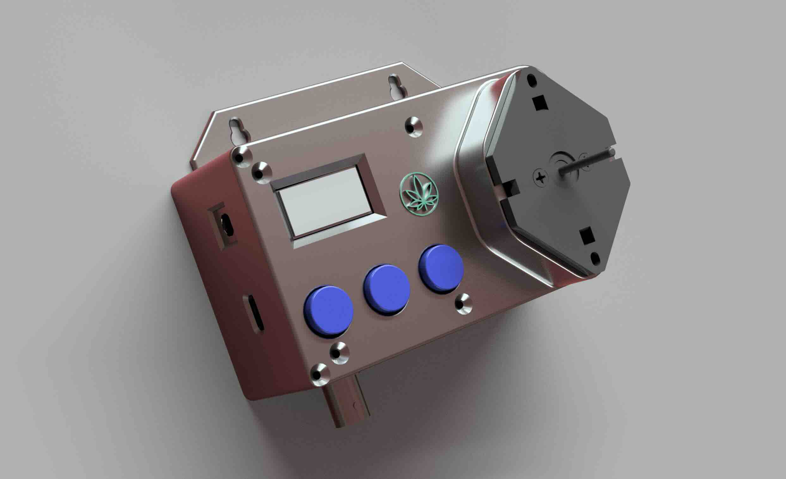
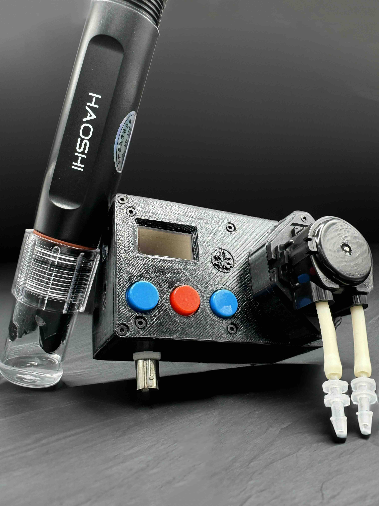

# Smart pH Controller

Read more on the DIY build at: https://akermania.github.io/

For detailed usage instructions visit - https://akermania.github.io/ph-controller/2024/07/10/post5.html

I opened a GoFundMe project here - <u><a style="color:black; font-style: italic;" href="https://gofund.me/360e19cd">https://gofund.me/360e19cd</a></u> 
You can donate or buy me a beer because you found this project helpful.

